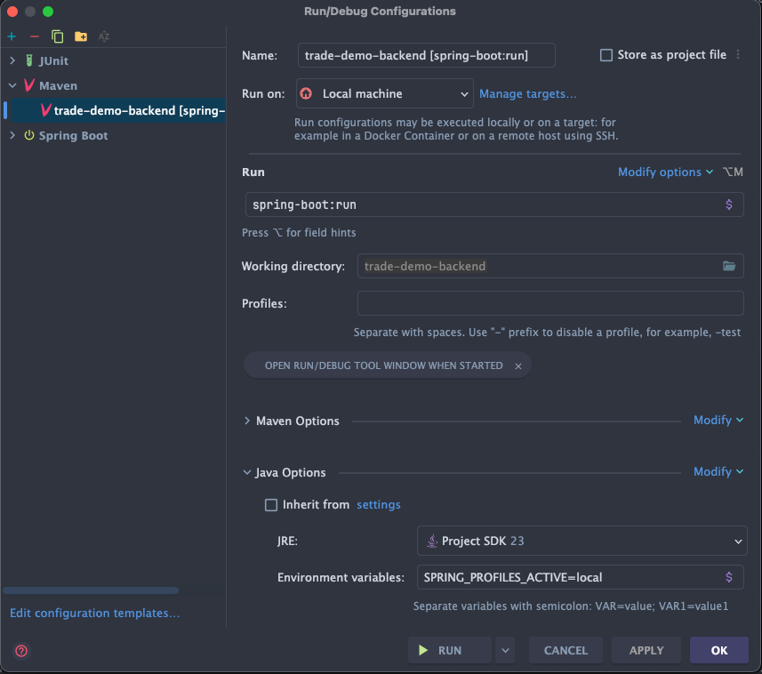

# Trade Demo Backend

Spring Boot 3.2.11 backend for the Core Delivery Platform (CDP)

---

> **Migration Note:** This repository was migrated from C# ASP.NET. 
> The original .NET code is preserved in the `dotnet-original-code` branch

---

## What is this?

A CDP-compliant Spring Boot backend that demonstrates:
- Full CRUD operations with MongoDB
- ECS JSON logging with trace ID propagation
- HTTP proxy configuration for outbound requests
- Actuator endpoints with production security defaults

---

## Quick Start

---

## Development

### Local Development

All infrastructure dependencies are centrally managed in `../trade-demo-local`. Choose the workflow that fits your needs:

#### Option 1: Backend in Docker (Production-like)

Run everything in Docker, including this backend service:

```bash
# Start infrastructure + all backend services
cd ../trade-demo-local
docker compose --profile services up -d

# After code changes to this service:
cd ../trade-demo-backend
docker compose up --build
```

**Pros:** Production-like environment
**Cons:** Slower iteration (~30-60s per rebuild)

#### Option 2: Native Backend (Fastest for Active Development)

Run infrastructure in Docker, this backend natively for hot reload:

```bash
# Terminal 1: Start infrastructure only
cd ../trade-demo-local
docker compose --profile infra up -d

# Terminal 2: Run this backend natively (hot reload)
cd ../trade-demo-backend
mvn spring-boot:run
```

Or if you wish to use the IDE run configuration to enable debugging:



**Pros:** Fast iteration, Spring Boot DevTools hot reload, easy debugging
**Cons:** None

#### Option 3: Individual Service in Docker

When you need to test just this service's Docker image:

```bash
# Terminal 1: Start infrastructure
cd ../trade-demo-local
docker compose --profile infra up -d

# Terminal 2: Start just this backend service
cd ../trade-demo-backend
docker compose up --build
```

**Pros:** Tests actual Docker image without starting other services
**Cons:** Slower than native execution

**Backend endpoints:**
- `GET /example` - List all examples
- `POST /example` - Create example
- `GET /example/{id}` - Get by ID
- `PUT /example/{id}` - Update example
- `DELETE /example/{id}` - Delete example

All endpoints support trace ID propagation via `x-cdp-request-id` header.

See `../trade-demo-local/README.md` for more infrastructure management options.


---

### Useful Docker Commands

```bash
# View logs for specific service
docker compose logs -f trade-demo-backend

# Rebuild specific service
docker compose up --build trade-demo-backend

# Access container shell
docker compose exec trade-demo-backend sh

# Remove everything including volumes
docker compose down -v

# Check service health
docker compose ps

# Identify any cloudwatch logged metrics
docker exec -it trade-demo-backend-localstack-1 /bin/bash
awslocal cloudwatch list-metrics

```

### Standard Metrics

Micrometer automatically collects standard metrics via Spring Boot Actuator:
- JVM metrics (memory, threads, GC)
- HTTP metrics (request counts, durations)
- Database metrics (connection pool, query times)

**View metrics:**
- **Development**: `/metrics` (when using dev profile: `--spring.profiles.active=dev`)
- **Production**: Metrics endpoint not exposed (security by default)

### Testing

Metrics are **disabled in test profile** using `NoOpMetricsService`.
No mocking required - inject `MetricsService` and call normally:

```java
@Autowired
private MetricsService metricsService;

@Test
void testOrderProcessing() {
    metricsService.counter("test.metric");  // Silent no-op in tests
}
```

---

### Querying Logs in Grafana

If your organization uses Grafana with OpenSearch datasource:

**Find errors with stack traces:**
```lucene
service.name:"trade-demo-backend" AND log.level:"ERROR" AND _exists_:error.stack_trace
```

**Find all errors (to verify service is logging):**
```lucene
service.name:"trade-demo-backend" AND log.level:"ERROR"
```

**View specific error types:**
```lucene
service.name:"trade-demo-backend" AND error.type:"java.lang.IllegalArgumentException"
```

### Verifying Field Mappings

Check which error fields are available in OpenSearch:

```json
GET /cdp-logs-*/_mapping/field/error.*
```

This shows all `error.*` field mappings. The `error.stack_trace` field should be type `text` with a `keyword` subfield:

```json
{
  "cdp-logs-2025.10.18": {
    "mappings": {
      "error.stack_trace": {
        "full_name": "error.stack_trace",
        "mapping": {
          "stack_trace": {
            "type": "text",
            "fields": {
              "keyword": {
                "type": "keyword",
                "ignore_above": 256
              }
            }
          }
        }
      }
    }
  }
}
```

---

## Available Experiments

The service exposes two types of endpoints: production-ready CRUD operations and temporary debug experiments for verifying CDP compliance.

### Example API (Production CRUD Operations)

Standard REST API demonstrating CDP-compliant CRUD operations with MongoDB. All endpoints support trace ID propagation via `x-cdp-request-id` header.

**Create an example:**
```bash
curl -X POST http://localhost:8085/example \
  -H "Content-Type: application/json" \
  -H "x-cdp-request-id: test-trace-123" \
  -d '{"name": "test-example", "value": "test-value"}'
```

**List all examples:**
```bash
curl http://localhost:8085/example \
  -H "x-cdp-request-id: test-trace-123"
```

**Get example by ID:**
```bash
curl http://localhost:8085/example/{id} \
  -H "x-cdp-request-id: test-trace-123"
```

**Update example:**
```bash
curl -X PUT http://localhost:8085/example/{id} \
  -H "Content-Type: application/json" \
  -H "x-cdp-request-id: test-trace-123" \
  -d '{"name": "updated-name", "value": "updated-value"}'
```

**Delete example:**
```bash
curl -X DELETE http://localhost:8085/example/{id} \
  -H "x-cdp-request-id: test-trace-123"
```

### Debug Experiments (CDP Compliance Verification)

```bash
curl -X POST http://localhost:8085/debug/run-metrics-experiments \
  -H "x-cdp-request-id: test-trace-123"
```

Returns: Status, metric count, EMF namespace, and CloudWatch verification path

**Get debug info:**

Returns current service configuration including service name/version, environment, EMF enabled status, namespace, and logging encoder type.

```bash
curl http://localhost:8085/debug/info \
  -H "x-cdp-request-id: test-trace-123"
```

Returns: Current service configuration for troubleshooting

**Note:** Debug endpoints emit structured ECS JSON logs with trace IDs that can be queried in OpenSearch Dashboards or CloudWatch Logs Insights.
---